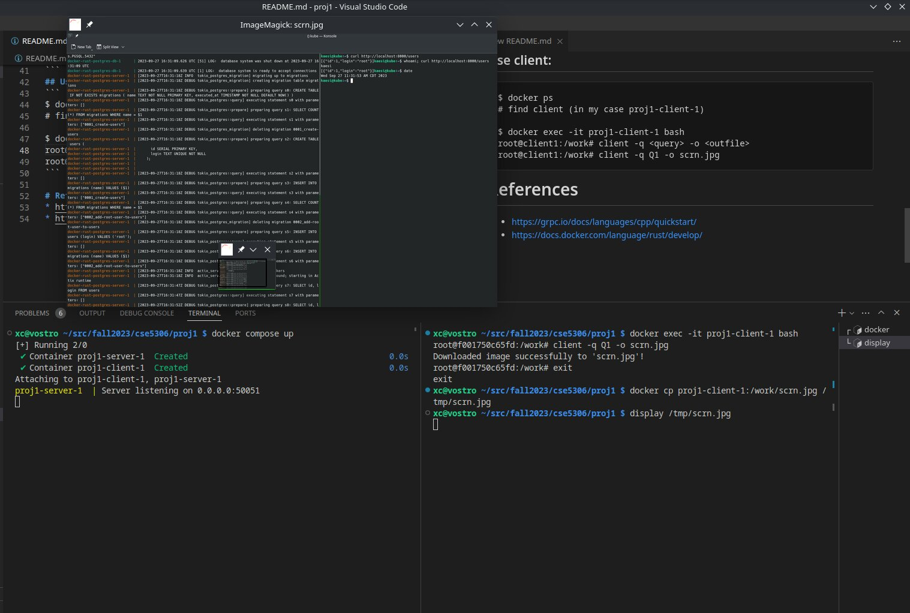

# CSE 5306-004: Project 1
### Team 14: Kaesi Manakkal & Syed Hussaini
# Run natively:
## Build client and server
* depends on grpc for c++
 * Follow https://grpc.io/docs/languages/cpp/quickstart/ to get a quick guide on how to install it

Install other dependencies:
```
sudo apt update && sudo apt install build-essential cmake
```

Build client and server:
```
mkdir -p src/build && cd src/build
cmake .. && make -j $(nproc)
```

## run client and server
In one terminal, run the server:
```
./server -d /root/of/project/db
```
In another terminal, use the client to make a search:
```
./client -q <query> -o <outfile>
```
Example:
```
./client -q Q1 -o random-screenshot.jpg     # get screenshot of the Q1 stage
display random-screenshot.jpg               # use imagemagick to display the file
```

# Using Docker compose:
## Build and run:
```
$ docker compose up --build
```
## Use client:
```
$ docker ps
# find client (in my case proj1-client-1)

$ docker exec -it proj1-client-1 bash
root@client1:/work# client -q <query> -o <outfile>
root@client1:/work# client -q Q1 -o scrn.jpg
```



# References
* https://grpc.io/docs/languages/cpp/quickstart/
* https://docs.docker.com/language/rust/develop/